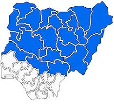
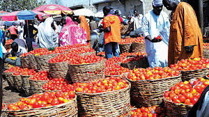

# FCB-Project-Documentation-
---
## Project Outline
This data analysis is to look at the amount of businesses and their types in Northen state of nIGERIA. It hopes to brinbg a consensus to the amount of businesses around the area.

## Tools Used

- Ms Excel [Ogbeni look here](https://www.microsoft.com/en-ng)
- Microsoft Power BI [Download here](https://apps.microsoft.com/?hl=en-us&gl=NG)
- Ms Word [download here](https://apps.microsoft.com/?hl=en-us&gl=NG)

 

|Name|Gender|Age group|Business|
|-------|------|-------|-----------|
|Ahmed|Male|20-25|Shoe production|
|Shaibu|Male|20-25|Fabric yarn|
|Solana|Female|30-45|Supermarket|
|Favour|Female|20-30|Wool|
